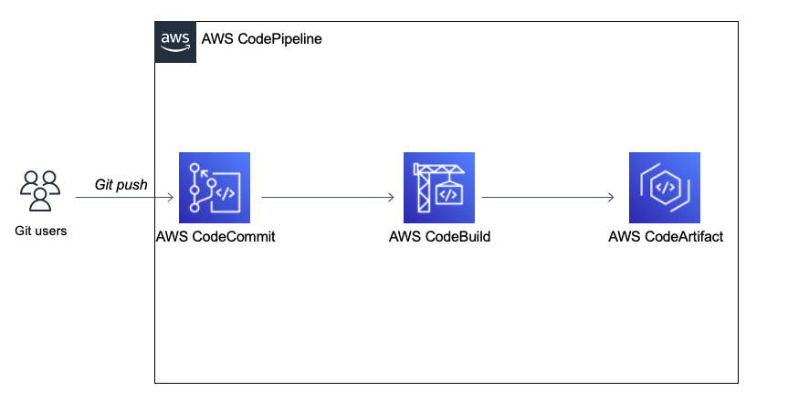

# Automated Pipeline to Publish Java Libraries to a CodeArtifact Repo
This POC uses Terraform to provision a AWS CodeCommit repository integrated with AWS CodePipeline and CodeBuild, which demonstrates an automated pipeline for publishing Java Libraries to CodeArtifact repositories.

CodeArtifact will act as a central Java artifact repository so that other teams can use the them as dependencies for applications they are building.

The CodePipeline consists of two stages:

1. A Source stage that is fed by the CodeCommit repository.
2. A Build stage that builds and publishes the Java library to CodeArtifact repository via CodeBuild.

The POC's architecture diagram is shown below:



## Deploy the Infra Resources

1. Clone this repo

```
git clone {this_repo_url}
cd codepipeline-codeartifact-publish-gradle-lib/

```

2. Edit the `main.tf` in the project root directory to set the resources arguments such as `aws_region`, `codeartifact_repository_name`, etc. For example:

```hcl
module "cicd_infra" {
  source = "./modules/cicd-infra"

  aws_region = "us-east-2"
  codeartifact_repository_name = "Artifact_Repo_Demo"
  codecommit_repo_name = "App_Repo_Demo"
  build_project_name = "Build_Demo"
  pipeline_name = "Pipeline_Demo"
  domain_name = "demo"
}
```

3. Run below commends to deploy the infrastructure:

```bash
terraform init
terraform apply
```

## Commit the Java Example Library Source Code to the CodeCommit Repo
Once Terraform provisioned the infrastructure resources, you can commit the sample Java code to trigger the Pipeline. 

The above steps should have provisioned a CodeCommit repository and a CodeArtifact repository, but they are both empty. So now we need to push the sample Java library code to the CodeCommit repo so that the pipeline can be triggered to publish the library.


```
cd lib
```

Commit the change to trigger the pipeline:

```shell
git init
git add .
git remote add origin {codecommit_clone_url}
git-defender --setup
git commit -m "init"
git push origin master
```

This push should trigger a CodePipeline execution. Open the AWS Console to watch the pipeline execute. Once the pipeline finishes, you can see the artifact is published in CodeArtifact repository.
